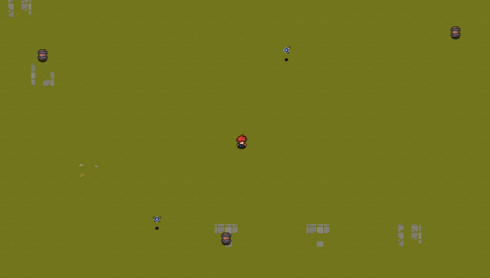

# **JS-GameEngine**

### **Demo Game:**
[demo](https://youtu.be/22Wo9riPfmc)

#### **NOTE:**
The provided public repo for this GameEngine starts with a simple template for a 2D top down game. Not all features shown in the demo are implemented in this template. This is done to streamline the main systems of GameEngine and not overwhelm the user.

### **Description:**
A GameEngine made using only JavaScript, HTML, and CSS, designed specifically for _2D_ game development. To use this GameEngine, basic knowledge of vanilla JavaScript is recommended 

### **Purpose/Use:**
This GameEngine is designed to help users design simple 2D games (either top-down or side-view) which can be run efficiently in the browser, due to several system optimizations. The GameEngine uses several simple design patterns, such as strategy, factory, and command to provide more robust code that the user can extend upon to make their desired game.  
* This GameEngine provides mobile support and resizing

### **Run Game:**
To run the game for testing, just open the index.html file in a local host :) 

### **Summary of Main Systems:**
The main systems currently implemented in the GameEngine are as follows:
* **Animation System:** stores all gameObjects of a given map/level. On every frame, this system will step through a single frame of a gameObject's animation dependent on the state of the animation object
* **CanvasLayer:** A render layer which generates (or uses) an html canvas element, and controls where gameObjects are drawn on the canvas
* **Collision System:** stores all gameObjects. On every frame, the system checks if the BoxColliders of any gameObjects or colliding and if so, updates the state of those gameObjects
* **Graphics System:** stores every CanvasLayer (render layer), assigns GameObjects to each layer. On every frame, this system call every CanvasLayer to redraw gameObjects in the window based on their current position
* **Game Manager:** Calls the functionality of every gameObject on every frame, and manages when/how the above listed systems execute

### **Summary of GameObjects/ChildObjects:**
The provided classes, GameObject, and ChildObject, act as the top level of inheritance for building custom game objects/features. These classess utilize fields to store their positional data in the level. Components are provided to allow for greater functionality of game objects: _BoxCollider, Animation, Spritesheet, ZoneCollider, MovementController, etc..._

### **TO DO:**
1. Create Phsyics System
